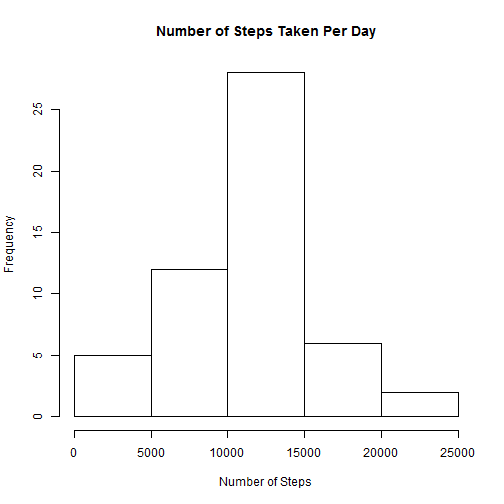
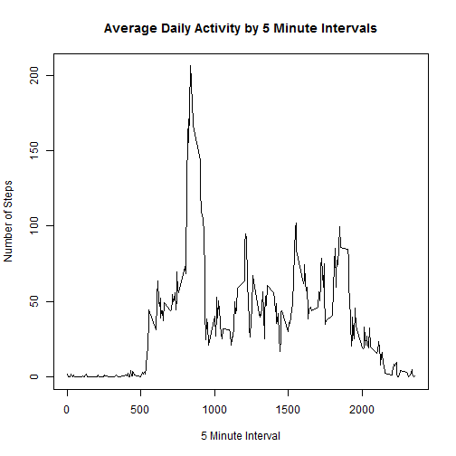
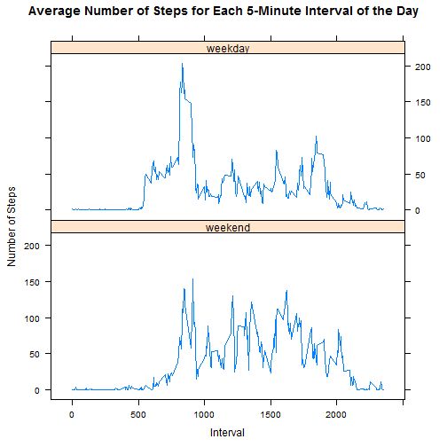

##Setup System and Data

Load needed libraries.


```r
library(dplyr)
library(lubridate)
library(lattice)
```

Load Activity data.


```r
##load data
activity <- read.csv("activity.csv")

## select needed columns and summarize steps taken by date
steps <- activity %>% select(steps, date) %>% na.omit()
steps1 <- summarize(group_by(steps, ymd(date)), sum(steps))
```

## Question 1
Histogram of the number of steps taken per day. NAs removed from this analysis.


```r
hist(steps1$`sum(steps)`, main = "Number of Steps Taken Per Day", 
     xlab = "Number of Steps")
```



Calculate mean and median of steps taken per day.


```r
mean(steps1$`sum(steps)`)
```

```
## [1] 10766.19
```

```r
median(steps1$`sum(steps)`)
```

```
## [1] 10765
```


## Question 2

Plot the average number of steps taken in each 5 minute interval of the day.

```r
intervals <- activity %>% select(steps, interval) %>% na.omit()
intervals1 <- summarize(group_by(intervals, interval), mean(steps))

plot(intervals1$interval, intervals1$`mean(steps)`, type = "l", main = "Average Daily Activity by 5 Minute Intervals", xlab = "5 Minute Interval", ylab = "Number of Steps")
```



####The interval around 8:30am appears to have the highest average steps.  
 

## Question 3

Number of rows containing missing values in the activity dataset.

```r
sum(is.na(activity))
```

```
## [1] 2304
```

Create a new dataset with no NA values.  NA values have been replaced by the median number of steps for the dataset. The first 6 rows of the new dataset, activity1, are shown below.

```r
activity1 <- activity
activity1$steps[which(is.na(activity1$steps))] <- median(activity1$steps, na.rm=TRUE)
head(activity1)
```

```
##   steps       date interval
## 1     0 2012-10-01        0
## 2     0 2012-10-01        5
## 3     0 2012-10-01       10
## 4     0 2012-10-01       15
## 5     0 2012-10-01       20
## 6     0 2012-10-01       25
```
Histogram of the number of steps taken per day. NAs have been replaced by the median for this analysis.


```r
activitysum <- summarize(group_by(activity1, ymd(date)), sum(steps))
hist(activitysum$'sum(steps)', main = "Number of Steps Taken Per Day", 
     xlab = "Number of Steps")
```


Calculate mean and median of steps taken per day after replacing NAs with the median daily steps.


```r
mean(activitysum$`sum(steps)`)
```

```
## [1] 9354.23
```

```r
median(activitysum$`sum(steps)`)
```

```
## [1] 10395
```
#### Replacing the missing values with the median (in this case 0 in all instances) has reduced both the mean and median values.  The mean decreased from 10,766 to 9,354.  The change to the median was not as significant, 10,765 to 10,395. 

#### Depending on the analysis being done, substituting values for missing values can skew the results. 

## Question 4

Plot showing differences in activity between weekdays and weekends.

```r
weekdays1 <- c('Monday', 'Tuesday', 'Wednesday', 'Thursday', 'Friday')

activity1$date <- ymd(activity1$date)

activity1 <- mutate(activity1, wday = factor((weekdays(activity1$date) %in% weekdays1), levels=c(FALSE, TRUE), labels=c('weekend', 'weekday')))

plot4data <- activity1 %>% group_by(interval, wday) %>% summarize_each(funs(mean))

xyplot(steps ~ interval | wday, data = plot4data, layout = c(1,2), type = "l", ylab = "Number of Steps", xlab = "Interval", main = "Average Number of Steps for Each 5-Minute Interval of the Day")
```


